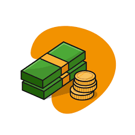

# [What is a checking account and how does it work?](https://jramirez032024.netlify.app/)

## What is a checking account used for?
With a checking account, also known as a demand deposit account, you can deposit money
with your bank that you can later withdraw or use checks or a debit card to pay others. It can
give you a secure place to store your cash and other payments made to you, and you can
easily access and spend this money when needed. When you have an account at an
FDIC-affiliated institution, your money is insured up to $250,000.

You can open a checking account in person or online. Once you've put money in the account,
you can usually use it to make purchases and payments right away.

## Why should you have a checking account?
Checking accounts can provide a convenient and secure way to store your money. They're
also considered an important part of proving your financial health as a checking account gives
you a documented track record of responsibly managing your cash and can help with
budgeting. Some of the top reasons to have a checking account include:

- Can allow direct deposit of your paychecks, providing near-instant access to funds

- Eliminates the need to carry or store a lot of cash, ensuring your money's safety and
security

- Helps you account for your income and expenses via bank-prepared statements and
online banking

- Gives you the ability to easily handle electronic transfers to and from your account on a
day-to-day basis

## Common checking account features
While different financial institutions have different offerings, checking accounts generally have
some standard services and common optional ones. Checking accounts can allow you to:

- Write checks to pay others

- Use a debit card, which allows you to make electronic and online transactions

- Withdraw or deposit funds at an ATM

- Access your account online or via a mobile app, where you can check your current
balance, transfer money, review recent transactions and otherwise manage your
account

- Set up recurring payments from your checking account such as automatic bill pay

- Transfer available funds between accounts at the same institution or to an account
elsewhere

- Name co-owners who can also access the account or beneficiaries who will get your
money if you pass away

## Maintenance fees
Some accounts have monthly maintenance fees. In some cases, you may be able to
waive this fee by keeping a certain amount of money in the account. Sometimes,
maintenance fees only apply if you aren't regularly using your account. You may be able to
avoid these fees by setting up a recurring direct deposit or making a few debit card
purchases.

## Overdraft fees
An overdraft charge happens when you spend more money than what's available in your
bank account. In these cases, the bank may charge two fees: one for overextending your
account balance and one for having to decline a transaction or return a check. These fees
can usually be avoided by getting overdraft protection, which automatically transfers funds
from another account or line of credit to cover the difference.

## ATM fees
Your debit card allows you to access your money and perform certain transactions at
ATMs. Usually, you won't be charged a fee when you use an ATM that's owned by your
bank or in its network. You can use other ATMs, but the transaction may cost you a few
extra dollars to pay the out-of-network ATM fees. Aim to use your bank's ATMs whenever
possible.